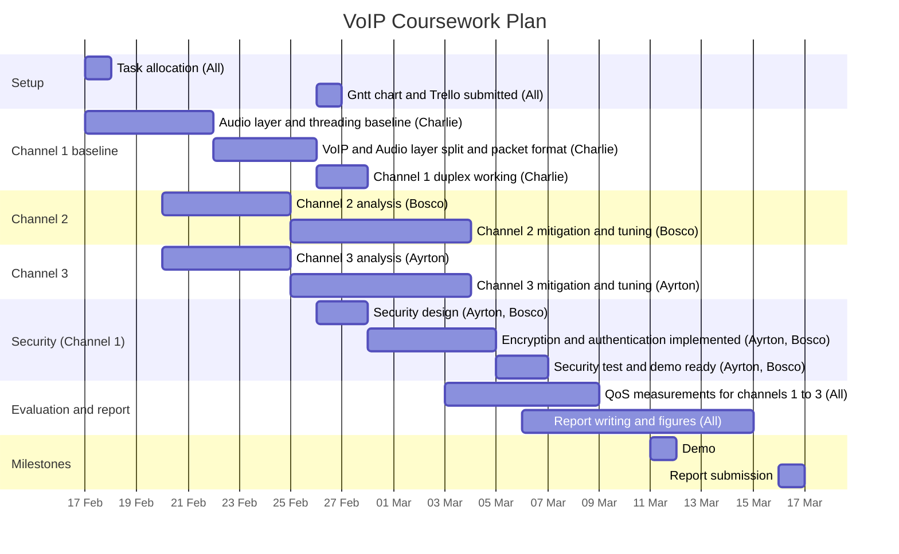

# Gantt Chart

---
# Channel Analysis
## Channel 2 (DatagramSocket2)
* Received: 7510 / 10000
* Loss: 2490 packets (24.9%)
* Maximum burst length: 15
* Average burst length: 5
## Channel 3 
* Received: 1540 / 2000
* Loss: 460 packets (23.0%)
* Burst loss: 263 bursts
* Max burst: 154 packets (about 4.9 s)
* Avg burst length: about 1.75 packets (about 56 ms)
* Avg delay: 45.3 ms
* Max delay: 325.3 ms

